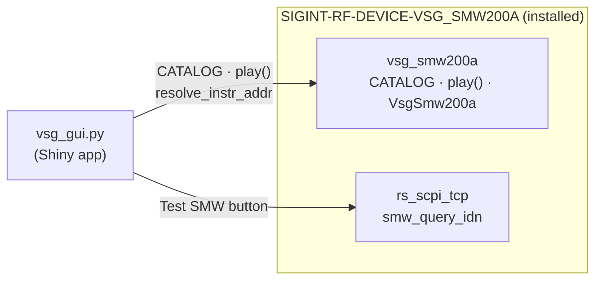

# SIGINT-RF-GUI

Shiny web GUI for the SMW200A ARB catalog.
All instrument logic (`CATALOG`, `play()`, generators, `rs_scpi_tcp`) lives in the sibling package **`SIGINT-RF-DEVICE-VSG_SMW200A`** — this repo only ships `vsg_gui.py` and its Shiny packaging.

---

## Quick start

```powershell
# 1. Create virtual environment at the repo root
python -m venv .venv

# 2. Allow script execution (only needed once per machine)
Set-ExecutionPolicy -ExecutionPolicy RemoteSigned -Scope CurrentUser

# 3. Activate the virtual environment
.\.venv\Scripts\activate

# 4. Install Poetry (package manager)
pip install poetry

# 5. Install all pinned dependencies from pyproject.toml
poetry install

# 6. Launch the GUI
sigint-rf-gui-shiny
```

> The device package (`SIGINT-RF-DEVICE-VSG_SMW200A`) is declared as a git dependency in `pyproject.toml` and is installed automatically by `poetry install` — no manual step needed.

Or with live reload during development:

```powershell
python -m shiny run --reload SIGINT-RF-GUI/SIGINT-RF-GUI/vsg_gui.py:app
```

---

## Module map



---

## Layout

```text
SIGINT-RF-GUI/
  pyproject.toml
  README.md
  SIGINT-RF-GUI/
    vsg_gui.py     ← Shiny app  (console script: sigint-rf-gui-shiny)
```

---

## Adding signals / modulations

See **[`../SIGINT-RF-DEVICE-VSG_SMW200A/README.md`](../SIGINT-RF-DEVICE-VSG_SMW200A/README.md)** — *Adding a new signal* section.
New signals appear automatically in the GUI dropdown once added to the device package `CATALOG`.

---

## Requirements

Python ≥ 3.12, **Shiny**, **RsSmw** + VISA runtime (for `play()`).
See `pyproject.toml` for pinned versions.

---

## License

MIT — see `pyproject.toml`.
